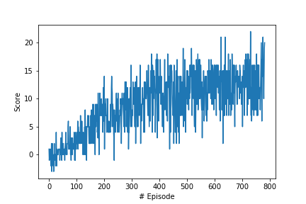

# Project Report
## Learning Algorithm
The used learning algorithm implements Deep Q Learning from the Google Atari paper. Two networks (local and target) are used to make the learning more stable.
The weights are transferred every iteration by using soft updates with parameter tau. Alternatively hard updates can be used by transferring the weights every n iterations. The network structure is quite simple, perhaps it could be optimized by more sophisticated parameter tuning. It looks as follow:
* Dense layer - input: 37 (state size) output: 256
* Dense layer - input: 256 output 128
* Dense layer - input: 128 output: (action size)

The gradient update is based on the mean squared error loss (i.e. the squared difference between the predicted reward of the network and the "ground truth" reward obtained from the observations from the environment interaction)
## Hyperparameters used
* Start value of epsilon: 1.0
* End value of epsilon:  0.01
* Epsilon decay: 0.999
* Size of hidden layers of the neural net: 256-128
* tau (for weight transfer of local and target network) : 0.001
* Batch Size: 64
* Discount Factor: 0.99
* Learning rate of Adam solver: 0.001

## Results
 

## Future work
* Implement prioritized experience replay (per.py already contains a github implementation, but for this environment it did not speed up training, or I made a mistake when using it...)
* Find out why the Keras implementation converges slower than the pytorch one
* Learn directly from the input images and not from the low dim observation state vector
