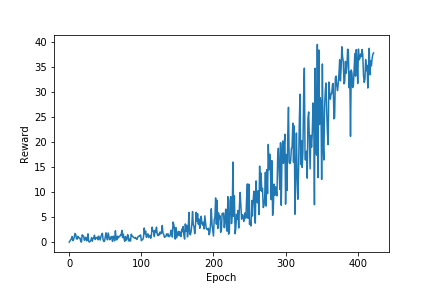

# Project Report
## Learning Algorithm
In order to solve this continuous control task the DPPG (deep deterministic policy gradient) algorithm is applied. It is suitable in this case as both state and action space are continuous and the environment is episodic.
The algorithm can be classified as actor critic method, i.e. it makes use of policy and value function optimization at the same time. The main components of the algorithm are the actor and the critic neural network.
The actor network gets the state as input and outputs the action. The critic gets the state and action as input and outputs the approximated value for the given (state,action) tuple.
In every iteration the critic loss is computed by using the squared difference between the true reward (observing the environment) and the computed current and discounted reward using the critic network (Bellman equation).
The actor loss in each iteration is computed by the negative value output of the critic network given the current state and the action computed by the current actor network as input.
As in the Deep Q-Learning algorithm local and target networks are used (both for actor and critic) to make gradient updates more stable and facilitate convergence.
I applied slight modifications of the algorithm in my implementation:
* Gradient updates are not done in every iteration, but only when sufficient number of samples have been added (NETWORKUPDATEINTERVAL)
* During each update UPDATESTEPSPERUPDATEINTERVAL are performed on randomly sampled batches from the replay memory

As a baseline I used the implementation from Samira Lanka (https://github.com/samlanka/DDPG-PyTorch) which is under MIT license. I adapted this implementation such it works with the
provided environment.

As the action space is no longer discrete the "standard" epsilon-greedy action selection does no longer work. Instead some noise is added to each action using a defined noise process.
In this implementation the Ornstein-Uhlenbeck-Prozess (https://de.wikipedia.org/wiki/Ornstein-Uhlenbeck-Prozess) is used, but also other noise processes are possible. The amount of noise
added is crucial for convergence of the algorithm, so it makes sense to do a lot of hyperparameter tuning here.

The network structure is quite simple, perhaps it could be optimized by more sophisticated parameter tuning. It looks as follow:

Critic network (Input: (state,action), Output: value)

* Dense layer - input: 33 (state size) output: 256
* Batchnorm layer - input: 256 output: 256
* ReLU layer - input:256 output:256
* Dense layer - input: 256 + 4 (action size) = 260 output 128
* ReLU layer - input:128 output:128
* Dense layer - input: 128 output: 1 (Q value)

Actor network (Input: state, Output: action)

* Batchnorm layer - input: 33 (state size) output: 33
* ReLU layer - input:33 output:33
* Dense layer - input: 33 output: 256
* Batchnorm layer - input: 256 output: 256
* ReLU layer - input:256 output:256
* Dense layer - input: 256 output 128
* Batchnorm layer - input: 128 output: 128
* ReLU layer - input:128 output:128
* Dense layer - input: 128 output: 4
* Tanh activation layer - input: 4 output: 4

Batchnorm layers are used to facilitate convergence. Using these layers is a state of the art practice in most machine learning tasks.
As activation functions ReLU is used which is the standard activation function for most deep learning tasks. As the state space has only 33 dimension it is sufficient to only use
fully connected layers. The last activation function is a tanh function, as the output actions have to be normalized between -1 and 1.

## Hyperparameters used

* Size of hidden layers of the neural net: 256-128 (this was the first shot and works well)
* tau (for weight transfer of local and target network) : 0.001
* Batch Size: 128 (I set it a bit higher to stabilize the training)
* Discount Factor: 0.99
* Learning rate of Adam solver for actor and critic network: 0.0001
* Buffer size of the replay buffer: 100000
* Sigma parameter for OrnsteinUhlenbeckActionNoise process: 0.2 (worked better than larger values for this task)
* Network update interval: 100 (update steps are only performed every 100 iterations, the rest of the time only sampling of the environment is performed)
* Update steps per update interval: 10 (number of gradiend descent steps run within each update step on random batches)

## Results
 

## Future work
* Convergence seems to be a bit too slow and there is too much oscillation. One could to hyperparameter tuning to speed up training and reduce noise.
* Implement prioritized experience replay
* Solve the 20 agent environment (the adaptions to sample from multiple agents in parallel should be quite simple). This should also speed up training as exploration of the environment is faster.
* Experiment with other algorithms such as PPO to solve the environment.
* Use (discounted) epsilon to reduce OU noise in each iteration, such the influence of noise gets less for later episodes.
