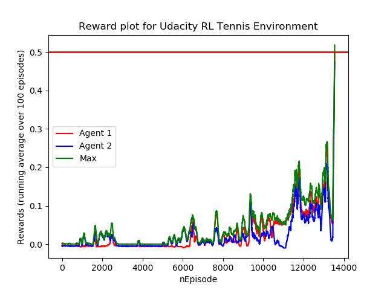

# Project Report
## Learning Algorithm

I used the Deep Deterministic Policy Gradient algorithm for multiple agents (MADDPG). It works in the same way as the DDPG algorithm I applied for the continuous control task, but makes use of critics
for each agent which also get the states and actions of the other agent as input. So there are two actor networks (local and target) as well as two critic networks for each agent. The actor only gets
the local agent observation of the agent as input and predicts the best action, whereas the critic sees the concatentation of actions and states of all agents and predicts the value of the (state,action) tuple from the view
of the current agent. The following figure illustrates this.

The algorithm in pseudocode looks as follows:

The network structure of the actor and critic networks are similar to the architecture I used for the continuous control task:

Critic network (Input: (state*2,action*2), Output: value)

* Dense layer - input: 2 $\times$ 24 (2* state size) output: 256
* Batchnorm layer - input: 256 output: 256
* ReLU layer - input:256 output:256
* Dense layer - input: 256 + 2*2 (2* action size) = 260 output 128
* ReLU layer - input:128 output:128
* Dense layer - input: 128 output: 1 (Q value)

Actor network (Input: state, Output: action)

* Batchnorm layer - input: 24 (state size) output: 33
* ReLU layer - input:24 output:24
* Dense layer - input: 24 output: 256
* Batchnorm layer - input: 256 output: 256
* ReLU layer - input:256 output:256
* Dense layer - input: 256 output 128
* Batchnorm layer - input: 128 output: 128
* ReLU layer - input:128 output:128
* Dense layer - input: 128 output: 2
* Tanh activation layer - input: 2 output: 2

As activation functions ReLU is used which is the standard activation function for most deep learning tasks. Batchnorm layers are used for a more stable training.

### Implementation Details
I decided to gather 128 (number of the batch size) samples before doing an update. I had the impression that otherwise there is not enough information for the agents available to learn.
Whenever an update is done it is done twice on two different random batches for each agent.

### Training observations
Hyperparameter tuning can be quite frustrating for this task. If this is not done right, the loss will oscillate and you question yourself if your implementation is wrong in general or if its really
just about hyperparameters...
For me the key was to add large noise at the beginning and to make sure to use batchnorm in the neural networks.
Furthermore the critic should not receive a concatentation of all states and all actions already in the input layer, but it should be split with an intermediate dense layer
in between. Furthermore I had the impression that there is a confusion about inputs/outputs of actor/critics when having a look at some other Github repositories for this task (e.g. some
repos also use the concatenation of all observations as actor input). I found my solution to be most conform with the algorithm described in the course.

## Hyperparameters used
* Noise factor: 8 (Factor used to multiply the OU noise with, it´s important to start with large noise at the beginning to overweight exploaration vs exploitation)
* Noise reduction factor: 0.99
* Size of hidden layers of the neural net: 256-128 (this was the first shot and works well)
* tau (for weight transfer of local and target network) : 0.1
* Batch Size: 256
* Discount Factor: 0.99
* Sigma for OU Noise: 0.01
* Theate for OU Noise: 0.15
* Learning rate of Adam solver for actor: 0.001
* Learning rate of Adam solver for critic: 0.001
* nSamplesToCollectBeforeUpdate: 128
* updateEvery: 1 (update every episode)
* nUpdatesPerUpdateStep: 2

## Results
 

## Future work
* Implement prioritized experience replay (per.py already contains a github implementation, but for this environment it did not speed up training, or I made a mistake when using it...)
* Hyperparameter tuning for faster/more stable convergence
* Impelementation of other algorithms (such as PPO for this task)

